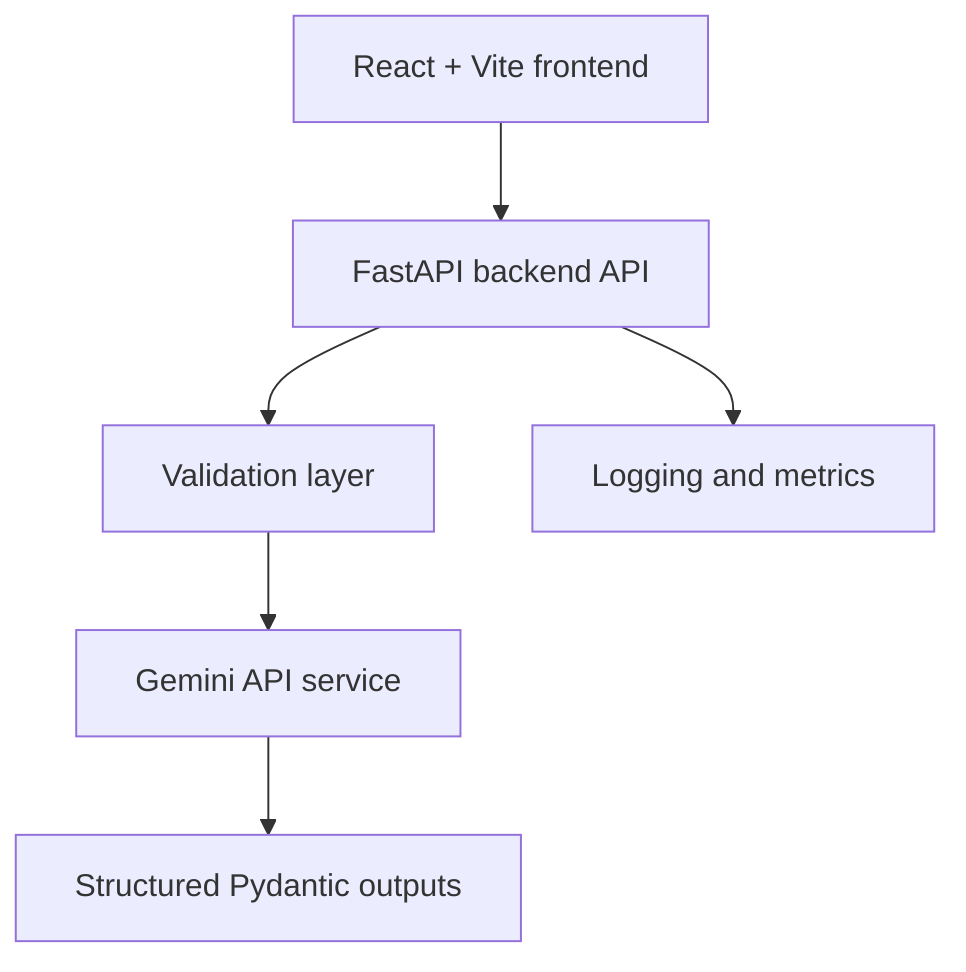

# AI Resume Analyzer and Career Assistant

A production-style fullstack workshop project that demonstrates AI orchestration, FastAPI backend patterns, Gemini API integration, structured outputs, Docker, CI/CD, monitoring, and deployment readiness.

## Architecture



## Features

- Upload a PDF/TXT resume or paste resume text.
- Submit a target role and optional job description.
- Generate an ATS score.
- Identify missing skills and resume strengths.
- Return structured JSON recommendations.
- Use Gemini structured output mode in production.
- Use a local heuristic fallback for development and CI when no API key is set.
- Expose `/health` and `/metrics` endpoints.

## Folder Structure

```text
.
├── backend
│   ├── app
│   │   ├── middleware
│   │   ├── routers
│   │   ├── schemas
│   │   ├── services
│   │   └── utils
│   ├── tests
│   ├── Dockerfile
│   └── requirements.txt
├── frontend
│   ├── src
│   │   ├── components
│   │   └── lib
│   ├── firebase.json
│   └── package.json
├── .github/workflows/ci.yml
├── docker-compose.yml
├── render.yaml
└── .env.example
```

## Local Setup

Create environment files:

```bash
cp .env.example .env
cp frontend/.env.example frontend/.env
```

Add your Gemini key to `.env` when you want live AI responses:

```bash
GEMINI_API_KEY=your_key_here
ENABLE_AI_FALLBACK=false
```

Leave `ENABLE_AI_FALLBACK=true` for local demos without a Gemini key.

## Backend

```bash
cd backend
python3.11 -m venv .venv
source .venv/bin/activate
pip install -r requirements.txt
uvicorn app.main:app --reload --host 127.0.0.1 --port 8000
```

Useful endpoints:

- `GET http://localhost:8000/health`
- `GET http://localhost:8000/live`
- `GET http://localhost:8000/ready`
- `GET http://localhost:8000/metrics`
- `POST http://localhost:8000/analyze`

Example API call:

```bash
curl -X POST http://localhost:8000/analyze \
  -F "target_role=MLOps Engineer" \
  -F "resume_text=MLOps Engineer with Python, FastAPI, Docker, monitoring, CI/CD, and cloud deployment experience. Built production APIs and improved release reliability by 35 percent."
```

## Frontend

```bash
cd frontend
npm install
npm run dev
```

Open `http://localhost:5173`.

## Dockerized Backend

```bash
docker compose up --build backend
```

The backend will run at `http://localhost:8000`.

## Render Deployment

This repo includes `render.yaml` for a Docker-based Render web service.

Set these environment variables in Render:

- `GEMINI_API_KEY`
- `CORS_ORIGINS`, for example your Firebase Hosting URL
- `ENABLE_AI_FALLBACK=false`

Render will use:

- Docker context: `./backend`
- Dockerfile: `./backend/Dockerfile`
- Health check: `/health`

## Firebase Hosting

From the frontend directory:

```bash
npm run build
firebase init hosting
firebase deploy
```

Use `frontend/firebase.json` and set:

```bash
VITE_API_BASE_URL=https://your-render-service.onrender.com
```

before building for production.

## CI/CD

GitHub Actions runs:

- Backend dependency install and pytest.
- Frontend dependency install and production build.

The workflow is defined at `.github/workflows/ci.yml`.

## API Response Shape

```json
{
  "ats_score": 82,
  "missing_skills": [],
  "strengths": [],
  "recommendations": []
}
```

## Notes for Workshops

The backend keeps the AI provider behind `GeminiResumeService`, so you can teach orchestration and reliability without mixing provider calls into the route layer. Validation happens before AI calls, structured output is enforced by Pydantic, and logs are emitted as JSON for easier monitoring demos.
