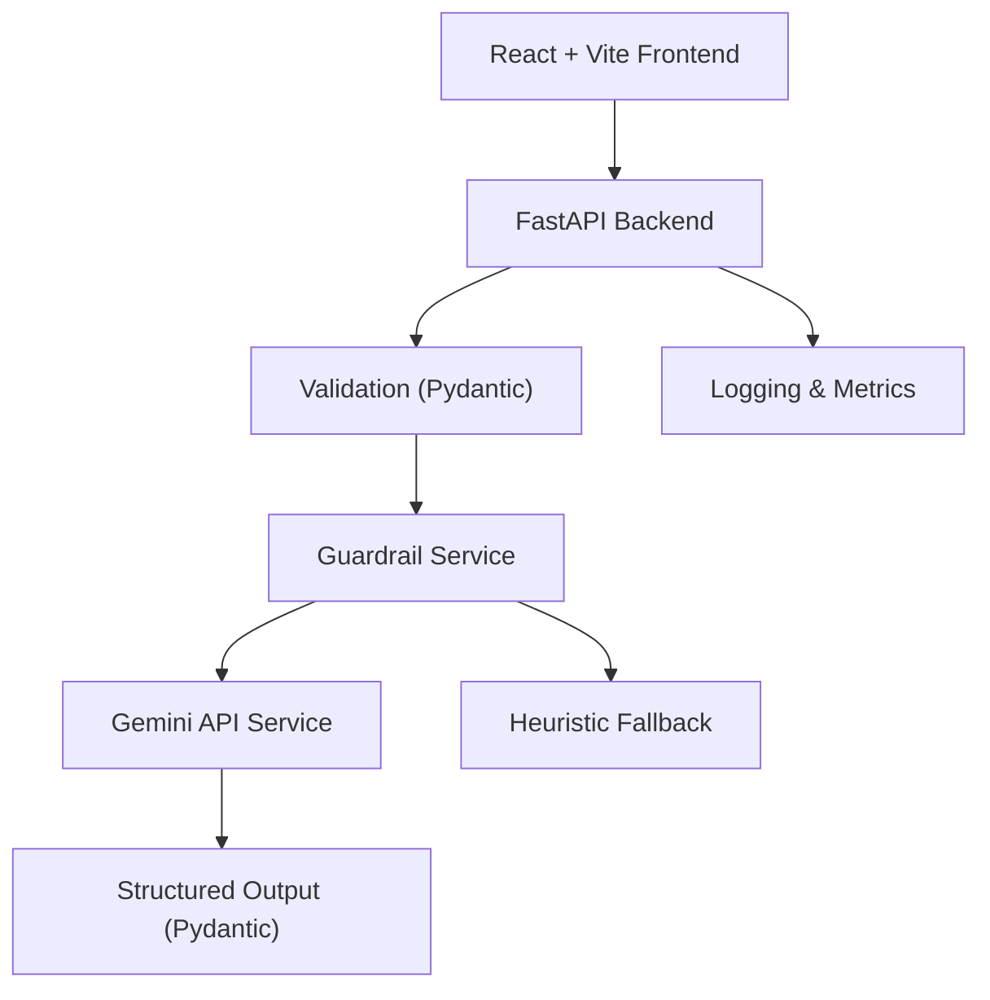

# AI Resume Analyzer

A production-style fullstack MLOps workshop project demonstrating AI orchestration, guardrails, FastAPI backend patterns, Gemini API integration, structured outputs, Docker, CI/CD, and cloud deployment.

**Live demo:** [https://llm-ops-workshop.onrender.com](https://llm-ops-workshop.onrender.com)

## Architecture



## Features

- Upload PDF/TXT resume or paste text
- Set a target role and optional job description
- Gemini-powered ATS scoring with structured JSON output
- Rule-based guardrails — prompt injection detection and topicality checks, zero tokens used
- Heuristic fallback when Gemini is unavailable
- `engine` field in every response indicating `gemini` or `heuristic`
- Dark / light mode with system preference detection
- `/health`, `/metrics`, `/live`, `/ready` observability endpoints

## Folder Structure

```
.
├── backend/
│   ├── app/
│   │   ├── middleware/       # Request context
│   │   ├── routers/          # analyze, health
│   │   ├── schemas/          # Pydantic models
│   │   ├── services/         # gemini, heuristic, guardrail, resume, monitoring
│   │   └── utils/            # logging, pdf, retry, exceptions
│   └── tests/
├── frontend/
│   └── src/
│       ├── components/       # Logo, AnalysisForm, ResultPanel, HealthBadge, ThemeToggle
│       └── lib/              # api.js
├── docs/                     # Architecture, backend, frontend, security, deployment docs
├── .github/workflows/        # CI reference (manual trigger only)
├── docker-compose.yml
├── render.yaml               # Backend (Docker) + Frontend (static) on Render
└── WORKSHOP.md               # Hands-on demo guide with guardrail bypass scenarios
```

## Local Setup

```bash
cp .env.example .env
cp frontend/.env.example frontend/.env
```

Set `GEMINI_API_KEY` in `.env` for live AI; leave `ENABLE_AI_FALLBACK=true` for demos without a key.

### Backend

```bash
cd backend
python3.11 -m venv .venv && source .venv/bin/activate
pip install -r requirements.txt
uvicorn app.main:app --reload --host 127.0.0.1 --port 8000
```

### Frontend

```bash
cd frontend
npm install
npm run dev    # http://localhost:5173
```

### Docker

```bash
docker compose up --build backend
```

## Running Tests

```bash
cd backend && source .venv/bin/activate
pytest          # all 15 tests
pytest tests/test_guardrails.py -v   # guardrail tests only
```

## API

| Method | Path | Description |
|---|---|---|
| POST | `/analyze` | Analyze a resume — returns ATS score, gaps, strengths, recommendations |
| GET | `/health` | System health and Gemini config status |
| GET | `/metrics` | In-memory request counts, error rate, latency |
| GET | `/live` | Liveness probe |
| GET | `/ready` | Readiness probe |

### Example

```bash
curl -X POST http://localhost:8000/analyze \
  -F "target_role=MLOps Engineer" \
  -F "resume_text=MLOps Engineer with Python, FastAPI, Docker, monitoring, CI/CD experience."
```

### Response shape

```json
{
  "ats_score": 82,
  "missing_skills": ["kubernetes", "terraform"],
  "strengths": ["docker", "ci/cd", "fastapi"],
  "recommendations": ["Add quantified impact to each bullet."],
  "engine": "gemini"
}
```

## Deployment

Both services auto-deploy to Render on every push to `main`.

| Service | Platform | URL |
|---|---|---|
| Backend (FastAPI + Docker) | Render | `https://llm-ops-workshop-api.onrender.com` |
| Frontend (React static) | Render | `https://llm-ops-workshop.onrender.com` |

See [`render.yaml`](render.yaml) for the full IaC config and [`docs/deployment.md`](docs/deployment.md) for details.

## Workshop Guide

See [`WORKSHOP.md`](WORKSHOP.md) for the full hands-on demo including guardrail bypass scenarios.

## Docs

| File | Contents |
|---|---|
| [`docs/architecture.md`](docs/architecture.md) | System and component architecture |
| [`docs/backend.md`](docs/backend.md) | Backend orchestration and request pipeline |
| [`docs/frontend.md`](docs/frontend.md) | Frontend components and data flow |
| [`docs/security.md`](docs/security.md) | Guardrails, security measures |
| [`docs/reliability.md`](docs/reliability.md) | Retry, fallback, error handling |
| [`docs/deployment.md`](docs/deployment.md) | Render deployment, env vars |
| [`docs/api_contracts.md`](docs/api_contracts.md) | Full API reference |
| [`docs/troubleshooting.md`](docs/troubleshooting.md) | Common issues and fixes |
