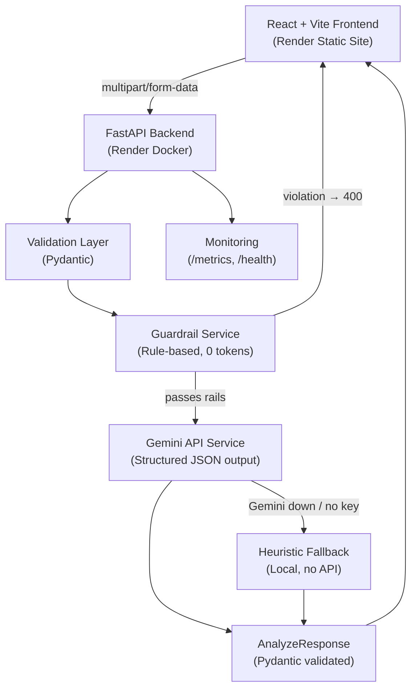

# System Architecture

## High-Level Overview

The AI Resume Analyzer is a modular, production-style system built for reliability, observability, and extensibility. It consists of a React frontend, a FastAPI backend, a rule-based guardrail layer, and an AI orchestration layer powered by the Gemini API.

## Architecture Diagram



## Request Pipeline (in order)

```
Request
  → RequestContextMiddleware   (attach request_id)
  → MonitoringMiddleware       (record latency + status)
  → CORS middleware
  → Router (analyze.py)
  → ResumeAnalyzerService
      1. _resolve_resume_text  (extract text from PDF or use raw text)
      2. _validate_payload     (Pydantic: min length, max length, strip whitespace)
      3. GuardrailService.check
            a. injection_rail  (regex: prompt injection / jailbreak patterns)
            b. topicality_rail (heuristic: ≥4 resume signal words required)
      4. GeminiResumeService   (API call with retry + timeout)
         or HeuristicResumeService  (fallback)
      5. AnalyzeResponse       (Pydantic output validation)
  → JSON response with engine field ("gemini" | "heuristic")
```

## Component Boundaries

| Component | Responsibility |
|---|---|
| **Frontend** | UI, form input, file upload, dark/light mode, result display, health badge |
| **Routers** | HTTP endpoint definitions, dependency injection wiring |
| **ResumeAnalyzerService** | Pipeline coordinator — does not contain business logic itself |
| **GuardrailService** | Rule-based input safety, zero AI tokens consumed |
| **GeminiResumeService** | Gemini API integration, prompt construction, retry, structured output |
| **HeuristicResumeService** | Local fallback analysis, keyword scoring, no external calls |
| **MonitoringService** | In-memory metrics store, request/error counts, latency |
| **Schemas** | `AnalyzePayload` (input), `AnalyzeResponse` (output), `ANALYSIS_JSON_SCHEMA` (Gemini constraint) |

## Key Engineering Decisions

- **Guardrails before AI**: The guardrail service runs after Pydantic validation but before any Gemini call, so injection attempts never reach the prompt and consume zero tokens.
- **Strict schema at both ends**: `AnalyzePayload` validates inputs; `AnalyzeResponse` validates Gemini's output via `model_validate_json`. Gemini is additionally constrained by `response_json_schema` at the API level.
- **Fallback is opt-out**: `ENABLE_AI_FALLBACK=true` by default in development and CI; set to `false` in production so failures surface rather than silently degrade.
- **engine field**: Every response declares which service produced it, making the fallback observable to the frontend and in logs.
- **Separation of concerns**: Validation, guardrails, AI, and monitoring are independent layers — each testable in isolation.
