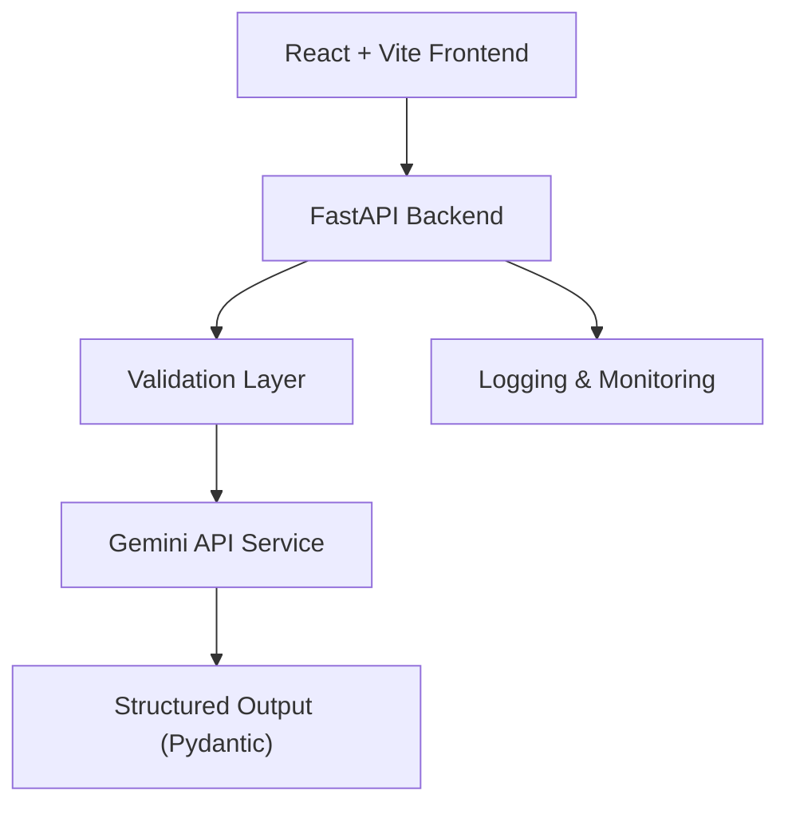

# System Architecture

## High-Level Overview

The AI Resume Analyzer is a modular, production-style system designed for reliability, clarity, and extensibility. It consists of a React frontend, a FastAPI backend, and an AI orchestration layer powered by Gemini API, all containerized and deployable to cloud platforms.

## Architecture Diagram

## Component Boundaries

- **Frontend**: User interface for uploading resumes, entering job context, and viewing results. Communicates with backend via HTTP.
- **Backend**: Orchestrates validation, AI calls, fallback logic, and structured response formatting. Exposes `/analyze`, `/health`, and `/metrics` endpoints.
- **AI Layer**: Handles Gemini API integration, prompt construction, and output schema enforcement. Provides fallback to local heuristics if Gemini is unavailable.
- **Monitoring**: In-memory metrics store for request counts, errors, and latency, exposed via `/metrics`.
- **Containerization**: Docker and docker-compose for local and cloud deployment. Render and Firebase for production.

## Data Flow

1. User submits resume and context via frontend.
2. Backend validates input, extracts text if needed, and builds analysis payload.
3. Backend calls Gemini API (or fallback) for analysis.
4. Structured JSON response is validated and returned to frontend.
5. Monitoring and logging capture request/response and errors.

## Key Engineering Decisions

- **Strict schema validation**: Ensures predictable, safe outputs for downstream consumers and agents.
- **Fallback logic**: Local heuristic analysis ensures reliability in CI/dev or Gemini outage.
- **Observability**: Metrics and logging are first-class for debugging and reliability.
- **Separation of concerns**: Each layer (validation, AI, monitoring) is modular and testable.
- **Containerization**: Enables reproducible, portable deployments.
