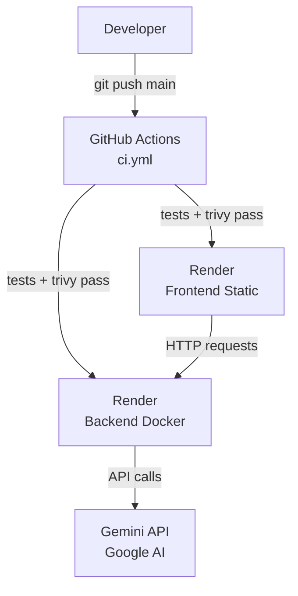

# Deployment Architecture

## Overview

Deploys to Render are gated on CI passing. Render auto-deploy is **disabled** on both services. Every push to `main` triggers GitHub Actions — only if all jobs pass (tests + Trivy scans) does the pipeline fire the Render deploy hooks.

## Deployment Diagram



## CI/CD Pipeline

```
git push origin main
  └─► GitHub Actions (.github/workflows/ci.yml)
        ├─ backend        — pytest (Python 3.13)
        ├─ frontend       — npm build
        ├─ trivy-fs       — CVE + secret + misconfig scan on repo
        ├─ trivy-image    — CVE scan on built Docker image
        └─ deploy         — runs only on main, only if all above pass
              ├─ curl RENDER_DEPLOY_HOOK_URL          → backend deploy
              └─ curl RENDER_DEPLOY_HOOK_URL_FRONTEND → frontend deploy
```

**GitHub Actions secrets required:**
| Secret | Purpose |
|---|---|
| `RENDER_DEPLOY_HOOK_URL` | Render backend deploy hook |
| `RENDER_DEPLOY_HOOK_URL_FRONTEND` | Render frontend deploy hook |

Both are set via `gh secret set` and never appear in the codebase.

## Services

| Service | Type | Platform | URL |
|---|---|---|---|
| `ai-resume-analyzer-api` | Docker web service | Render | `https://llm-ops-workshop-api.onrender.com` |
| `ai-resume-analyzer-frontend` | Static site | Render | `https://llm-ops-workshop.onrender.com` |

Both are defined in [`render.yaml`](../render.yaml).

## Backend (Docker)

- **Docker context**: `./backend`
- **Dockerfile**: `./backend/Dockerfile`
- **Health check**: `/health` — Render waits for 200 before marking deploy successful
- **Free tier caveat**: Spins down after ~15 min of inactivity; first request after sleep takes ~30s

### Required environment variables (set in Render dashboard)

| Variable | Value |
|---|---|
| `GEMINI_API_KEY` | Your Google AI Studio key |
| `CORS_ORIGINS` | `https://llm-ops-workshop.onrender.com` |
| `ENABLE_AI_FALLBACK` | `false` (production) |

## Frontend (Static Site)

- **Root directory**: `frontend`
- **Build command**: `npm install && npm run build`
- **Publish directory**: `dist`
- **SPA rewrite**: All routes rewrite to `/index.html` (configured in `render.yaml`)

### Required environment variables (set in Render dashboard)

| Variable | Value |
|---|---|
| `VITE_API_BASE_URL` | `https://llm-ops-workshop-api.onrender.com` |

## Local Development

```bash
# Backend
cd backend && source .venv/bin/activate
uvicorn app.main:app --reload --host 127.0.0.1 --port 8000

# Frontend
cd frontend && npm run dev
```

Or with Docker:

```bash
docker compose up --build backend
```

## Running checks locally

```bash
# Backend tests
cd backend && pytest

# Frontend build check
cd frontend && npm run build

# Security scan (requires Trivy)
trivy fs . --scanners vuln,secret,misconfig --severity HIGH,CRITICAL
```

## Trivy vulnerability suppression

Unfixable OS-level CVEs (no upstream fix available) are listed in `.trivyignore` at the repo root with a comment explaining each suppression.

## Environment Variable Reference

| Variable | Default | Where |
|---|---|---|
| `GEMINI_API_KEY` | — | Backend (Render) |
| `GEMINI_MODEL` | `gemini-2.5-flash` | Backend |
| `GEMINI_TIMEOUT_SECONDS` | `30` | Backend |
| `GEMINI_RETRY_ATTEMPTS` | `3` | Backend |
| `ENABLE_AI_FALLBACK` | `true` (dev), `false` (prod) | Backend |
| `CORS_ORIGINS` | `http://localhost:5173` | Backend |
| `ENVIRONMENT` | `development` | Backend |
| `LOG_LEVEL` | `INFO` | Backend |
| `MAX_RESUME_CHARS` | `20000` | Backend |
| `MAX_UPLOAD_MB` | `5` | Backend |
| `VITE_API_BASE_URL` | `http://localhost:8000` | Frontend |
