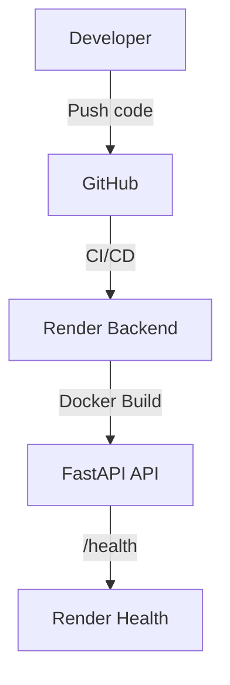

# Deployment Architecture

## Overview

The system is designed for cloud-native deployment with minimal manual steps. Backend and frontend are containerized and deployable to Render and Firebase Hosting, respectively.

## Backend Deployment (Render)

- **Containerization**: Backend is built as a Docker image using `backend/Dockerfile`.
- **Render Configuration**: `render.yaml` defines service, health check, and environment variables.
- **Environment Variables**: All secrets and config are injected at runtime.
- **Health Checks**: Render pings `/health` for liveness.
- **Scaling**: Stateless, can be scaled horizontally.

### Deployment Diagram

## Frontend Deployment (Firebase)

- **Build**: Vite builds static assets to `dist/`.
- **Firebase Hosting**: `firebase.json` configures rewrites and public directory.
- **CI/CD**: GitHub Actions can automate deploys.

### Deployment Flow

1. Developer pushes code to GitHub.
2. GitHub Actions run tests and build images.
3. Backend is deployed to Render via Docker.
4. Frontend is deployed to Firebase Hosting.

## Local Development

- Use `docker-compose.yml` to run both backend and frontend locally.
- Hot reload supported for development.

## Environment Variables

- All sensitive config is managed via `.env` files and Render/Firebase secrets.
