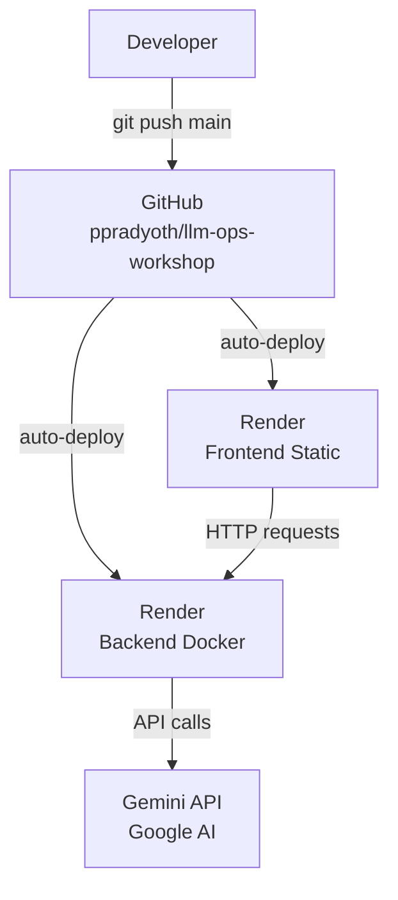

# Deployment Architecture

## Overview

Both frontend and backend auto-deploy to Render on every push to `main`. No manual deploy steps required after initial setup.

## Deployment Diagram



## Services

| Service | Type | Platform | URL |
|---|---|---|---|
| `ai-resume-analyzer-api` | Docker web service | Render | `https://llm-ops-workshop-api.onrender.com` |
| `ai-resume-analyzer-frontend` | Static site | Render | `https://llm-ops-workshop.onrender.com` |

Both are defined in [`render.yaml`](../render.yaml).

## Backend (Docker)

- **Docker context**: `./backend`
- **Dockerfile**: `./backend/Dockerfile`
- **Health check**: `/health` — Render waits for 200 before marking deploy successful
- **Free tier caveat**: Spins down after ~15 min of inactivity; first request after sleep takes ~30s

### Required environment variables (set in Render dashboard)

| Variable | Value |
|---|---|
| `GEMINI_API_KEY` | Your Google AI Studio key |
| `CORS_ORIGINS` | `https://llm-ops-workshop.onrender.com` |
| `ENABLE_AI_FALLBACK` | `false` (production) |

## Frontend (Static Site)

- **Root directory**: `frontend`
- **Build command**: `npm install && npm run build`
- **Publish directory**: `dist`
- **SPA rewrite**: All routes rewrite to `/index.html` (configured in `render.yaml`)

### Required environment variables (set in Render dashboard)

| Variable | Value |
|---|---|
| `VITE_API_BASE_URL` | `https://llm-ops-workshop-api.onrender.com` |

## Local Development

```bash
# Backend
cd backend && source .venv/bin/activate
uvicorn app.main:app --reload --host 127.0.0.1 --port 8000

# Frontend
cd frontend && npm run dev
```

Or with Docker:

```bash
docker compose up --build backend
```

## CI Reference

`.github/workflows/ci.yml` is included as a reference for workshop participants. It is set to `workflow_dispatch` (manual only) due to account billing. To enable automatic runs on push, update the `on:` trigger and ensure GitHub Actions billing is active.

To run checks locally:

```bash
# Backend tests
cd backend && pytest

# Frontend build check
cd frontend && npm run build
```

## Environment Variable Reference

| Variable | Default | Where |
|---|---|---|
| `GEMINI_API_KEY` | — | Backend (Render) |
| `GEMINI_MODEL` | `gemini-2.5-flash` | Backend |
| `GEMINI_TIMEOUT_SECONDS` | `30` | Backend |
| `GEMINI_RETRY_ATTEMPTS` | `3` | Backend |
| `ENABLE_AI_FALLBACK` | `true` (dev), `false` (prod) | Backend |
| `CORS_ORIGINS` | `http://localhost:5173` | Backend |
| `ENVIRONMENT` | `development` | Backend |
| `LOG_LEVEL` | `INFO` | Backend |
| `MAX_RESUME_CHARS` | `20000` | Backend |
| `MAX_UPLOAD_MB` | `5` | Backend |
| `VITE_API_BASE_URL` | `http://localhost:8000` | Frontend |
