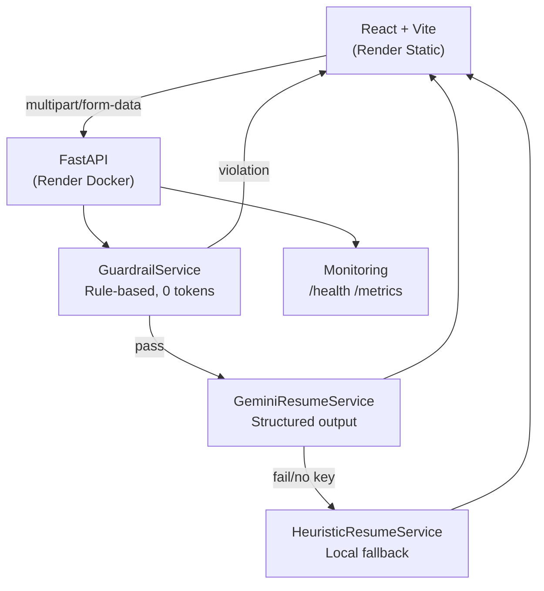

# Project Explainer — AI Resume Analyzer

High-context system overview for AI agents, contributors, and workshop facilitators.

---

## Purpose

A production-style AI-powered resume analyzer that demonstrates MLOps best practices: input validation, rule-based guardrails, AI orchestration with fallback, structured outputs, observability, security scanning, and cloud-native deployment.

---

## Mental Model

```
User input
  → Pydantic (validate shape and length)
  → GuardrailService (rule-based: injection + topicality, zero tokens)
  → GeminiResumeService (Gemini API, retry + timeout, JSON schema enforced)
     ↳ HeuristicResumeService (fallback, local keyword scoring)
  → AnalyzeResponse (Pydantic validates output)
  → JSON with engine field ("gemini" | "heuristic")
```

The guardrail layer is the critical MLOps addition — it sits between validation and AI, consuming zero tokens, and blocking obvious attacks and off-topic inputs before they reach the expensive layer.

---

## System Architecture



---

## File Map (key files only)

```
backend/app/
  main.py                  — app setup, middleware, global error handlers
  config.py                — Settings (pydantic-settings, lru_cache)
  routers/analyze.py       — POST /analyze endpoint
  routers/health.py        — GET /health /live /ready /metrics
  schemas/resume.py        — AnalyzePayload, AnalyzeResponse, ANALYSIS_JSON_SCHEMA
  services/resume_service.py    — pipeline coordinator
  services/guardrail_service.py — injection + topicality rails
  services/gemini_service.py    — Gemini API, retry, structured output
  services/heuristic_service.py — local keyword scoring fallback
  services/monitoring_service.py — in-memory metrics singleton
  utils/exceptions.py      — AppError hierarchy (includes GuardrailError)
  utils/retry.py           — retry_async decorator (exponential backoff + jitter)
  utils/pdf.py             — PDF/TXT text extraction
  utils/logging.py         — structured JSON logging setup

frontend/src/
  App.jsx                  — theme hook, layout, nav, hero, steps, analyzer, footer
  lib/api.js               — analyzeResume(), getHealth()
  components/Logo.jsx      — SVG document mark
  components/ThemeToggle.jsx    — dark/light toggle (moon/sun icons)
  components/AnalysisForm.jsx   — tab input (text/file), form, submit
  components/ResultPanel.jsx    — skeleton, empty state, score ring, list blocks
  components/HealthBadge.jsx    — backend status + engine indicator
  components/ErrorBanner.jsx    — inline error display
  components/ErrorBoundary.jsx  — React error boundary with reset
```

---

## Invariants (never violate these)

1. `GuardrailService.check()` is called before every AI call in `ResumeAnalyzerService.analyze()`
2. Every `AnalyzeResponse` has `engine` set — `"gemini"` or `"heuristic"`
3. All config is accessed via `get_settings()` — never `os.environ` directly in services
4. `AnalyzeResponse.model_validate_json()` validates Gemini output before it returns
5. Resume text and PII are never written to logs

---

## Extension Points

| Want to add | Where |
|---|---|
| New API endpoint | `app/routers/` + `app/services/` + `app/schemas/` + wire in `main.py` |
| New guardrail rule | `guardrail_service.py` — add pattern to `_INJECTION_PATTERNS` or signal to `_RESUME_SIGNALS` |
| Different AI provider | Implement same interface as `GeminiResumeService`, swap in `get_resume_analyzer_service()` |
| Persistent metrics | Replace `MonitoringService` with Prometheus client, expose `/metrics` in Prometheus format |
| Authentication | Add FastAPI dependency to routers, inject before guardrail check |
| New frontend section | Add component in `frontend/src/components/`, import in `App.jsx` |

---

## Deployment

Both services defined in `render.yaml`. Auto-deploy on push to `main`.

| Service | Type | URL |
|---|---|---|
| Backend | Docker web service | `https://llm-ops-workshop-api.onrender.com` |
| Frontend | Static site | `https://llm-ops-workshop.onrender.com` |

---

## CI / Security

- `.github/workflows/ci.yml` — pytest + npm build + Trivy fs scan + Trivy image scan (manual trigger only)
- `scripts/scan.sh` — run all scans locally
- `.trivyignore` — suppress known false positives by CVE ID
- `.env` files are gitignored; secrets live in Render environment variables only
