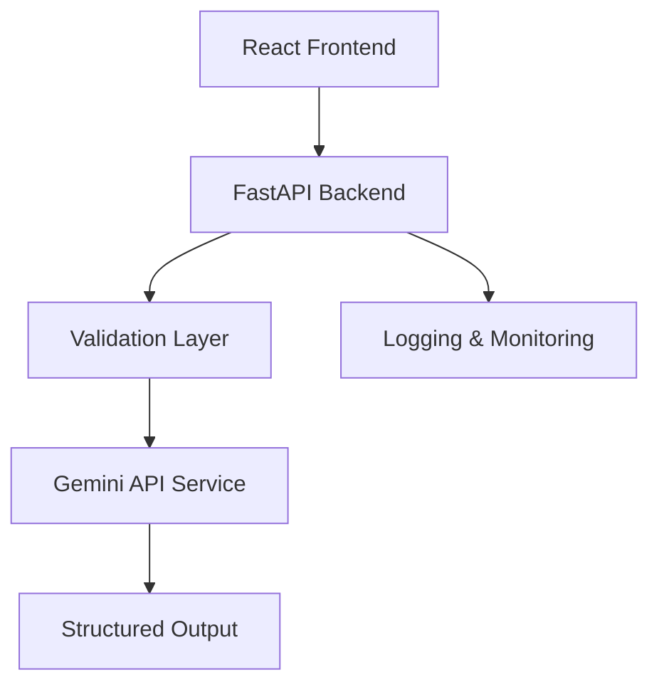
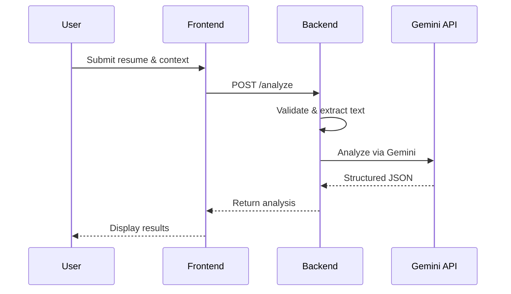
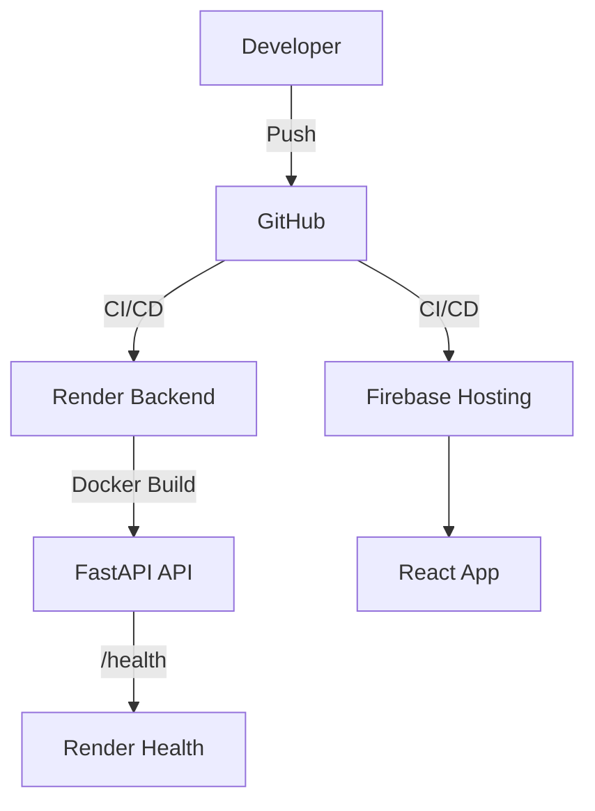

# Project Explainer: AI Resume Analyzer & Career Assistant

---

## 1. Project Purpose

To provide a production-style, reliable, and extensible AI-powered resume analysis and career assistant system. The project demonstrates best practices in AI orchestration, validation, monitoring, and deployment for MLOps education and real-world readiness.

## 2. System Goals

- Deliver actionable, structured resume analysis using state-of-the-art AI (Gemini API)
- Ensure reliability, observability, and graceful degradation
- Be easy to extend, debug, and operate by both humans and AI agents
- Serve as a reference for production-grade MLOps and AI system design

## 3. High-Level Architecture

- **Frontend**: React + Vite, TailwindCSS
- **Backend**: FastAPI, modular services, strict validation
- **AI Layer**: Gemini API (with fallback)
- **Deployment**: Docker, Render (backend), Firebase (frontend)

## 4. Component Responsibilities

- **Frontend**: Collects user input, displays results, handles errors, and health status.
- **Backend**: Orchestrates validation, AI calls, fallback, and structured output. Exposes `/analyze`, `/health`, `/metrics`.
- **AI Layer**: Handles prompt construction, Gemini API calls, output schema enforcement, and fallback logic.
- **Monitoring**: Tracks requests, errors, and latency for observability.

## 5. Backend Orchestration Flow

1. Receive request (resume text/file, target role, job description)
2. Validate input (schema, file type, size, mutual exclusivity)
3. Extract text from file if needed
4. Build analysis payload
5. Call Gemini API (with timeout/retry)
6. If Gemini fails, fallback to local heuristic analysis
7. Validate and return structured JSON response
8. Log request, errors, and metrics

## 6. AI Integration Flow

- Gemini API is called with a prompt and strict JSON schema
- Output is validated against schema (Pydantic)
- Fallback logic ensures reliability if Gemini is unavailable
- All AI errors are logged and surfaced with request IDs

## 7. Validation & Reliability Layers

- Pydantic schemas for all input/output
- Centralized error handling and logging
- Timeout and retry logic for AI calls
- Fallback to local analysis for resilience
- Health and metrics endpoints for monitoring

## 8. Deployment Architecture

- Backend: Dockerized, deployed to Render via `render.yaml`
- Frontend: Static build, deployed to Firebase Hosting
- Local: `docker-compose.yml` for unified dev experience

## 9. Monitoring & Observability

- In-memory metrics store tracks requests, errors, latency
- `/metrics` endpoint exposes operational stats
- Structured logging with request context and error details

## 10. Security & Guardrails

- Input validation and sanitization
- File type/size restrictions
- No persistent storage of user data
- Secrets managed via environment variables
- CORS restricts frontend origins
- Error responses never leak sensitive info

## 11. CI/CD Workflow

- GitHub Actions runs tests and builds on push
- Backend deployed to Render, frontend to Firebase
- Health checks and metrics ensure operational readiness

## 12. Failure Modes

- **Gemini API outage**: Fallback to local analysis, log incident, return degraded output
- **Input errors**: Return actionable error with request ID
- **Unexpected exceptions**: Log and return generic error with traceability

## 13. Engineering Tradeoffs

- **Strict schema enforcement**: Ensures reliability but may reject ambiguous input
- **In-memory monitoring**: Simple for demo, not persistent for production
- **No persistent storage**: Reduces risk, but limits auditability
- **Fallback logic**: Prioritizes reliability over perfect accuracy

## 14. Future Extension Points

- Add authentication/authorization for multi-user scenarios
- Integrate persistent monitoring/logging (e.g., Prometheus, ELK)
- Support more file types or languages
- Add more granular analytics and alerting
- Extend AI logic for richer recommendations

## 15. Key Operational Principles

- Favor reliability and observability over feature creep
- All errors are actionable and traceable
- System is safe to operate in demo and real-world settings
- Designed for easy extension by both humans and AI agents

## 16. Mental Model of the Entire System

- **Input**: User provides resume and context
- **Validation**: Backend enforces schema and safety
- **Orchestration**: Backend coordinates extraction, AI, fallback, and output
- **AI Analysis**: Gemini (or fallback) produces structured recommendations
- **Output**: Strict JSON returned to frontend
- **Monitoring**: Every request is logged and measured
- **Deployment**: Containers ensure reproducibility and portability

---

## Request Lifecycle Diagram

---

## Deployment Diagram

---

## How to Safely Extend the System

- Add new endpoints by creating routers and services in backend
- Extend AI logic by updating Gemini or heuristic services
- Add new validation or monitoring layers as needed
- Update frontend components for new features
- Always enforce schema validation and structured outputs
- Document all changes for future agents and contributors

---

## Summary

This project is engineered for clarity, reliability, and extensibility. Every component, validation, and workflow is designed to be understandable and maintainable by both humans and advanced AI agents. The system is safe to operate, easy to extend, and robust against failures, making it an ideal reference for modern AI-powered MLOps systems.
